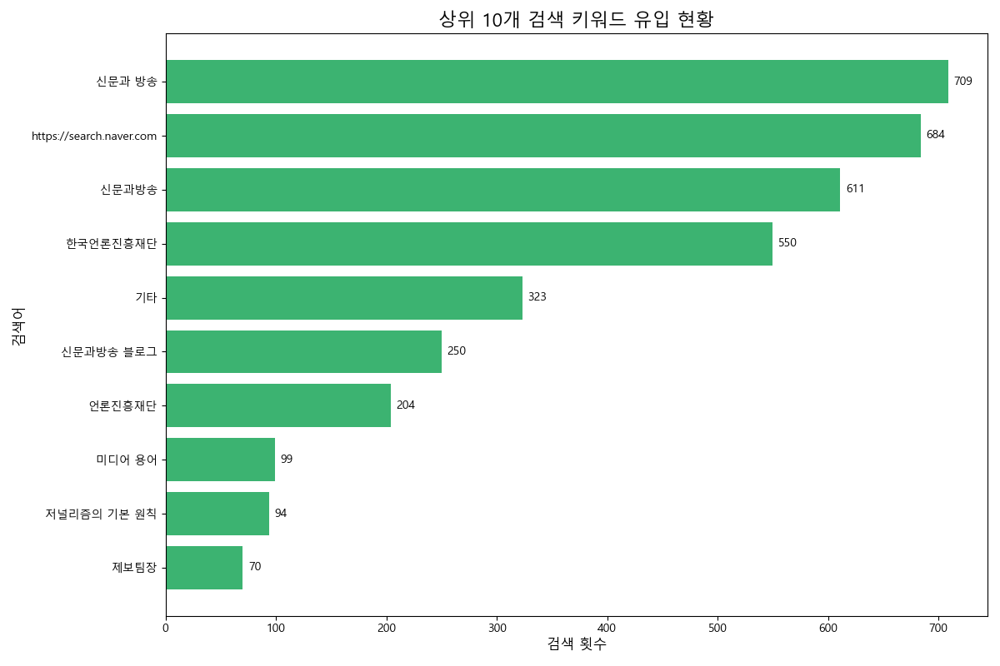
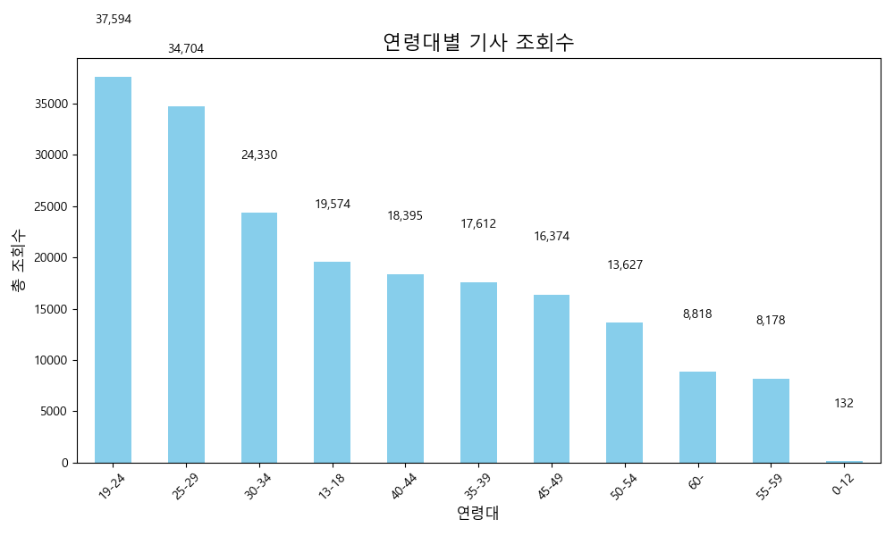
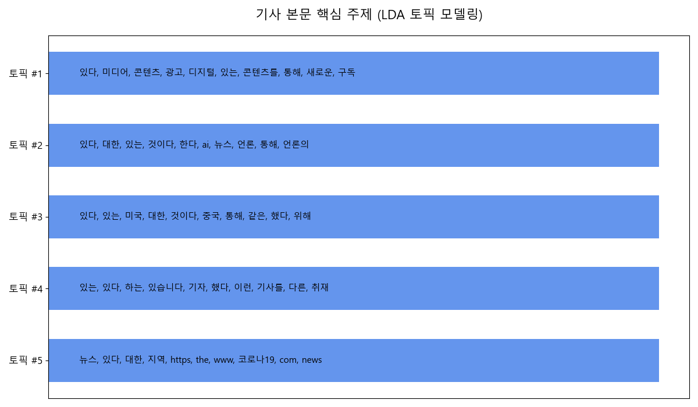

# 「신문과 방송」 독자 데이터 분석 기반 아이디어 제안

---

## 1. 분석 목표

본 분석은 「신문과 방송」의 독자 데이터를 심층적으로 분석하여, 콘텐츠 기획 및 서비스 개선에 실질적으로 기여할 수 있는 데이터 기반의 창의적이고 혁신적인 아이디어를 제안하는 것을 목표로 합니다.

---

## 2. 핵심 분석 결과 요약

데이터 분석을 통해 다음과 같은 세 가지 핵심적인 인사이트를 발견했습니다.

**1. 핵심 독자층은 '19-24세'이며, 검색을 통해 유입된 독자가 많습니다.**

*   '전체' 연령대를 제외했을 때, '19-24세' 그룹이 가장 높은 조회수를 기록하는 핵심 독자층으로 나타났습니다.
*   또한, 'Google'과 '네이버' 등 검색을 통해 '언론사 채용', '저널리즘 원칙' 등 명확한 목적을 가지고 유입되는 독자가 상당수 존재함을 확인했습니다.

**2. 기사 본문에는 '미디어 기술', '저널리즘' 등 전문적인 주제가 다수 포함되어 있습니다.**

*   기사 본문에 대한 NLP 토픽 모델링 결과, 독자들이 소비하는 콘텐츠는 '미디어와 기술(AI, 데이터)', '저널리즘과 취재 과정', '미디어 비즈니스' 등 전문적인 주제 그룹으로 구성되어 있음을 확인했습니다.

**3. 특정 연령/성별 그룹은 특정 주제에 높은 관심을 보입니다.**

*   데이터 교차 분석 결과, '30대 여성' 독자들은 '미디어·AI 트렌드'에, '19-24세 여성'은 '커버스토리'에 높은 관심을 보이는 등 인구통계학적 특성에 따라 관심사가 나뉘는 경향을 확인했습니다.

---

## 3. 아이디어 제안

분석 결과를 바탕으로, **'신규 독자 유입 → 충성 독자 전환 → 전문성 심화 및 수익화'** 로 이어지는 단계적 발전 전략에 따라 다음 세 가지 아이디어를 제안합니다.

### **Strategy 1. 신규 독자 유입 기반 구축**

**아이디어 3: '검색 유입' 극대화를 위한 전문 용어 해설 콘텐츠 강화**

*   **근거:** '저널리즘의 기본 원칙', '미디어 용어' 등 구체적인 정보 검색을 통해 독자가 유입되는 패턴을 활용합니다. 이는 SEO(검색엔진최적화) 전략의 중요성을 보여줍니다.

    

*   **실행 방안:** 블로그 내에 '미디어 용어 사전' 또는 '저널리즘 개념'과 같은 별도 카테고리를 신설하여, 검색에 자주 사용되는 전문 용어와 개념을 설명하는 양질의 콘텐츠를 축적합니다.
*   **기대 효과:** 검색을 통해 유입되는 신규 독자를 안정적으로 확보하고, '신문과 방송'을 미디어 분야의 권위 있는 정보 소스로 포지셔닝하여 브랜드 신뢰도를 높입니다.

### **Strategy 2. 핵심 타겟 독자 충성도 강화**

**아이디어 1: Z세대 언론인 지망생을 위한 '미디어 취업/현직' 시리즈 기획**

*   **근거:** 핵심 독자층인 '19-24세' 그룹과 '언론사 채용' 등 직접적인 검색 키워드에 주목했습니다. 이들은 언론 산업 현안과 직업으로서의 저널리즘에 관심이 많습니다.

    

*   **실행 방안:** '주니어 기자 생존기', '언론사별 채용 분석', '현직자 인터뷰' 등 Z세대의 눈높이에 맞는 현실적인 콘텐츠를 '커버스토리' 형식으로 연재합니다.
*   **기대 효과:** 핵심 타겟 그룹의 충성도를 높여 충성 독자로 전환시키고, 미래의 언론인들을 잠재 독자로 확보합니다.

### **Strategy 3. 전문성 심화 및 수익 모델 다각화**

**아이디어 2: '미디어 트렌드 & AI' 위클리 브리핑 뉴스레터 론칭**

*   **근거:** '30대 여성' 등 특정 그룹이 '미디어·AI 트렌드'에 높은 관심을 보이며, NLP 분석 결과 '미디어와 기술', '미디어 비즈니스'가 핵심 주제로 나타났습니다.

    

*   **실행 방안:** 매주 AI, 숏폼, 데이터 저널리즘 등 최신 미디어 기술 및 비즈니스 모델을 쉽게 해설하는 이메일 뉴스레터를 발송합니다.
*   **기대 효과:** 높은 전문성을 바탕으로 충성 독자 커뮤니티를 형성하고, 이를 기반으로 향후 유료 구독 모델 등 수익 다각화의 기회로 삼을 수 있습니다.

---

## 4. 결론 및 기대효과

제안된 세 가지 아이디어는 개별적으로 실행되는 것이 아니라, **'검색을 통한 신규 유입 → 핵심 독자층 집중 공략 및 충성도 강화 → 전문성을 기반으로 한 수익 모델 탐색'** 으로 이어지는 선순환 구조를 형성합니다. 이 전략적 접근을 통해 「신문과 방송」은 단기적인 조회수 상승뿐만 아니라, 장기적으로 충성도 높은 독자 커뮤니티를 구축하고 미디어 시장에서의 전문적 입지를 더욱 공고히 할 수 있을 것으로 기대합니다.

---

## 부록: 분석 재현을 위한 통합 코드

아래는 본 보고서의 분석 및 시각화 자료 생성을 위한 통합 파이썬 코드입니다.

```python
import pandas as pd
import matplotlib.pyplot as plt
import matplotlib.font_manager as fm
from sklearn.feature_extraction.text import CountVectorizer
from sklearn.decomposition import LatentDirichletAllocation
import warnings

warnings.filterwarnings('ignore', category=FutureWarning)

# --- 1. 기본 설정 및 데이터 로드 ---
def setup_korean_font():
    font_path = 'C:/Windows/Fonts/malgun.ttf'
    font_prop = fm.FontProperties(fname=font_path)
    plt.rc('font', family=font_prop.get_name())
    plt.rcParams['axes.unicode_minus'] = False

def load_data():
    try:
        contents = pd.read_excel("../data/contents.xlsx")
        metrics = pd.read_excel("../data/article_metrics_monthly.xlsx")
        referrer = pd.read_excel("../data/referrer.xlsx")
        demographics1 = pd.read_excel("../data/demographics_part001.xlsx")
        demographics2 = pd.read_excel("../data/demographics_part002.xlsx")
        demographics = pd.concat([demographics1, demographics2], ignore_index=True)
        return contents, metrics, referrer, demographics
    except FileNotFoundError as e:
        print(f"오류: 데이터 파일을 찾을 수 없습니다. {e}")
        return None, None, None, None

# --- 2. 아이디어별 분석 및 시각화 ---

# 아이디어 3: 검색 유입 분석
def analyze_and_visualize_search_keywords(referrer):
    search_referrers = referrer[referrer['referrer'].str.contains('검색', na=False)]
    top_keywords = search_referrers['referrer_detail'].value_counts().nlargest(10)
    
    df = top_keywords.to_frame().reset_index()
    df.columns = ['Keyword', 'Count']
    df = df.sort_values(by='Count', ascending=True)

    plt.figure(figsize=(12, 8))
    bars = plt.barh(df['Keyword'], df['Count'], color='mediumseagreen')
    plt.title('상위 10개 검색 키워드 유입 현황', fontsize=16)
    plt.xlabel('검색 횟수', fontsize=12)
    plt.ylabel('검색어', fontsize=12)
    for bar in bars:
        plt.text(bar.get_width() + 5, bar.get_y() + bar.get_height()/2, f'{int(bar.get_width())}', va='center')
    plt.tight_layout()
    output_path = "../visualizations/idea3_top_search_keywords.png"
    plt.savefig(output_path)
    print(f"아이디어 3 시각화 저장: {output_path}")

# 아이디어 1: 연령대별 분석
def analyze_and_visualize_age_groups(demographics):
    age_group_views = demographics.groupby('age_group')['views'].sum().drop('전체', errors='ignore').sort_values(ascending=False)
    
    plt.figure(figsize=(10, 6))
    bars = age_group_views.plot(kind='bar', color='skyblue')
    plt.title('연령대별 기사 조회수', fontsize=16)
    plt.xlabel('연령대', fontsize=12)
    plt.ylabel('총 조회수', fontsize=12)
    plt.xticks(rotation=45)
    for bar in bars.patches:
        plt.text(bar.get_x() + bar.get_width()/2, bar.get_height() + 5000, f'{int(bar.get_height()):,}', ha='center', va='bottom')
    plt.tight_layout()
    output_path = "../visualizations/idea1_age_distribution.png"
    plt.savefig(output_path)
    print(f"아이디어 1 시각화 저장: {output_path}")

# 아이디어 2: NLP 토픽 모델링
def analyze_and_visualize_nlp_topics(contents):
    korean_stopwords = ['의', '가', '이', '은', '들', '는', '좀', '잘', '걍', '과', '도', '를', '으로', '자', '에', '와', '한', '하다']
    
    vectorizer = CountVectorizer(max_df=0.9, min_df=2, stop_words=korean_stopwords)
    doc_term_matrix = vectorizer.fit_transform(contents['content'].dropna())
    
    lda = LatentDirichletAllocation(n_components=5, random_state=42)
    lda.fit(doc_term_matrix)
    
    topics = {}
    feature_names = vectorizer.get_feature_names_out()
    for idx, topic in enumerate(lda.components_):
        top_words_idx = topic.argsort()[:-10 - 1:-1]
        top_words = [feature_names[i] for i in top_words_idx]
        topics[f'토픽 #{idx+1}'] = ", ".join(top_words)

    fig, ax = plt.subplots(figsize=(12, 7))
    y_pos = range(len(topics))
    ax.barh(y_pos, [1]*len(topics), align='center', color='cornflowerblue', height=0.6)
    ax.set_yticks(y_pos)
    ax.set_yticklabels(topics.keys(), fontsize=12)
    ax.invert_yaxis()
    ax.set_title('기사 본문 핵심 주제 (LDA 토픽 모델링)', fontsize=16, pad=20)
    ax.tick_params(axis='x', which='both', bottom=False, top=False, labelbottom=False)
    for i, (topic, keywords) in enumerate(topics.items()):
        ax.text(0.05, i, f'{keywords}', va='center', ha='left', fontsize=11, color='black')
    plt.tight_layout()
    output_path = "../visualizations/idea2_nlp_topics.png"
    plt.savefig(output_path)
    print(f"아이디어 2 시각화 저장: {output_path}")

# --- 3. 메인 실행 로직 ---
def main():
    setup_korean_font()
    contents, metrics, referrer, demographics = load_data()
    
    if referrer is not None:
        analyze_and_visualize_search_keywords(referrer)
    if demographics is not None:
        analyze_and_visualize_age_groups(demographics)
    if contents is not None:
        analyze_and_visualize_nlp_topics(contents)

if __name__ == '__main__':
    main()
```
